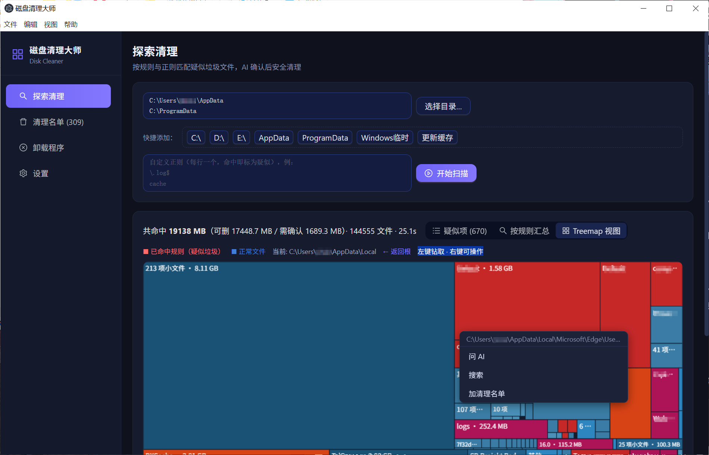
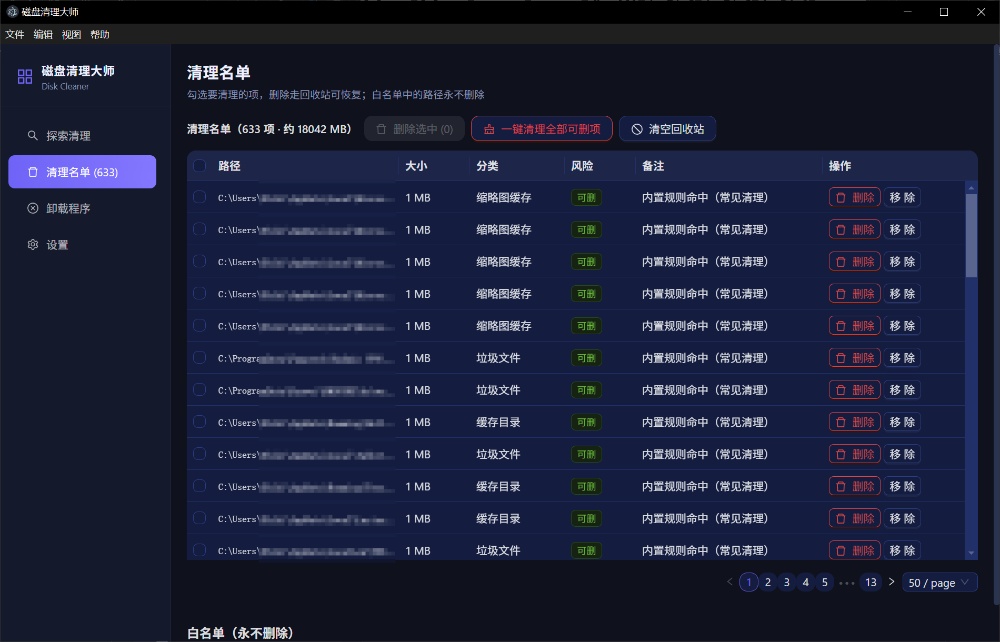
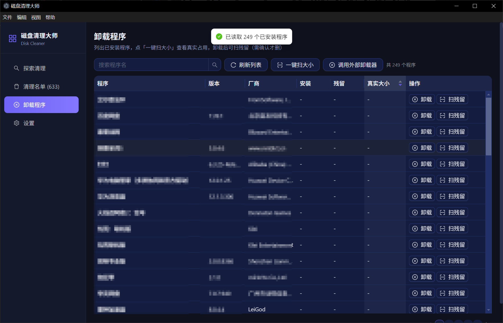

# 磁盘清理大师 · Disk Cleaner Master

> 正则规则驱动的智能磁盘清理 · AI 辅助判定 · Squarified Treemap 可视化 · 全程走回收站的安全清理

<p>
  <a href="./LICENSE"></a>
  
  
  
  
  
</p>

**磁盘清理大师**是一款开源的 Windows 磁盘清理桌面应用。它是用**透明的正则规则库**标出疑似垃圾，用 **AI / 联网搜索**帮你判断拿不准的项，你判断出的垃圾目录以后会默认清除，打造个性化高覆盖率清除清单，用 **Treemap 热力图**让你一眼看清磁盘空间被谁吃掉，最后所有删除**一律走系统回收站**。

---

## 目录

- [功能亮点](#功能亮点)
- [界面预览](#界面预览)
- [快速开始](#快速开始)
- [使用指南](#使用指南)
- [工作原理](#工作原理)
- [安全设计：五道防线](#安全设计五道防线)
- [性能实测](#性能实测)
- [目录结构](#目录结构)
- [技术栈](#技术栈)
- [数据与隐私](#数据与隐私)
- [路线图](#路线图)
- [贡献](#贡献)
- [开源协议](#开源协议)

---

## 功能亮点

### 🧭 探索清理（Scan）

- **多根目录扫描**：支持任意目录多选；快捷按钮一键添加常见区域（各盘符、AppData、ProgramData、Windows 临时目录、更新缓存）
- **内置规则库**：22 条精心打磨的正则规则，覆盖浏览器/应用缓存、崩溃转储、临时文件、日志、Windows Update 缓存、开发工具缓存（npm/pip/uv/Gradle/Maven）、AI 模型缓存等
- **自定义正则**：想扫什么自己写，命中即标记
- **三级风险分级**：`safe`（纯垃圾，可放心删）/ `warning`（可删但需确认）/ `danger`（勿删），一眼区分
- **缓存/临时类自动入名单**：扫描结束，缓存目录 / 临时目录 / 系统缓存 / 缩略图缓存类 safe 项自动进入清理名单待命（对标 CCleaner / BleachBit 默认清理项），无需二次点击；日志、崩溃报告、垃圾文件等其他 safe 项保留在扫描结果里，由你手动「加入名单」，避免误清
- **结果持久化**：扫描结果自动保存，切换页面、重启应用都不丢

### 🗺️ Treemap 磁盘可视化

- **Squarified 布局算法**：方块尽量方正，拒绝又细又长的“条形图”
- **红色 = 命中规则的疑似垃圾，蓝色 = 正常文件**，面积即大小，空间分布一目了然
- **点击钻取**进入子目录，**右键菜单**直接对该块「问 AI / 联网搜索 / 加入清理名单」
- 自动合并微小项、限制递归深度，大图不碎、不卡

### 🤖 AI + 联网辅助判定

- 每个疑似项旁都有三个动作：**问 AI**、**联网搜索**、**加入名单**
- **问 AI**：自动采样目录内部文件名作为上下文，调用任意 OpenAI 兼容接口（`/chat/completions`），返回结构化判定：`safe / warning / danger` + 一句话理由 + 建议删除方式
- **联网搜索**：一键用 Bing / 百度 / Google 搜索该目录名，看看别人怎么说
- API Key 只存在你本地的 JSON 配置里，从不外传

### 🗑️ 清理名单（Clean List）

- 逐项勾选、批量删除，**删除一律进系统回收站**，可恢复
- **一键清理 safe 项**
- 白名单管理：标记过的路径永不删除、扫描时直接跳过

### 📦 软件卸载 + 残留清理

- 从注册表三个 `Uninstall` 键（HKLM 64/32 位 + HKCU）完整列出已安装程序，中文名不乱码
- 一键调起程序自带卸载器；也可配置调用外部卸载器（如 IObit Uninstaller）
- **残留扫描**：卸载后扫描 `AppData（Local/Roaming/LocalLow）+ ProgramData + 安装目录` 找出残留，**不扫 Program Files**，避免误伤同名程序
- 关键词提取保守克制：只取程序主名（去括号、去版本号）和 ≥4 字符的长单词，**不使用厂商名**（Microsoft/Adobe 之类太宽泛会误伤）
- 残留**默认全部不勾选**，展示完整路径 + 大小 + 匹配原因，你勾选才删
- **一键扫大小**：一次遍历文件系统，算出每个程序的「安装体积 + 残留体积 = 真实占用」，按大小降序，揪出最占空间的软件

---

## 界面预览

### 探索清理 · Treemap 磁盘热力图
> 实测数据：共命中 **19 608.6 MB**（可删 18 917 / 需确认 1 643）· **144 422** 文件 · **31.1s** · **633** 疑似项
> 红色 = 命中规则的疑似垃圾，蓝色 = 正常文件；点击钻取，右键菜单（问 AI / 搜索 / 加名单）



### 清理名单 · 一键清回回收站
> **633 项 / 约 18 042 MB** 排队待清理 · 支持「删除选中」「一键清理全部可删项」「清空回收站」· 删除一律进系统回收站可恢复



### 卸载程序 · 一键扫真实占用
> 从注册表读取 **249 个**已安装程序 · 「一键扫大小」算出每个程序的「安装 + 残留 = 真实占用」并按大小排序



---

## 快速开始

**环境要求**：Node.js ≥ 18，Windows 10/11

```bash
# 1. 安装依赖
npm install

# 2. 开发模式（热更新；主进程内嵌 Vite dev server，端口占用时自动换端口）
npm run dev

# 3. 生产构建 + 运行
npm run build
npm start

# 4. 打包 Windows 安装包（NSIS，输出到 release/）
npm run dist
```

> 国内加速小贴士：Electron 二进制可设镜像 `ELECTRON_MIRROR=https://npmmirror.com/mirrors/electron/`；electron-builder 用 `--registry=https://registry.npmmirror.com`。

---

## 使用指南

1. **扫描**：打开「探索清理」→ 点快捷按钮或「选择目录」添加扫描区域 →（可选）加自定义正则 → 开始扫描
2. **研判**：看 Treemap 找大块红色区域；对拿不准的项点「问 AI」或「联网搜索」
3. **收名单**：点「加入名单」把疑似项收进清理名单（safe 项已自动加入）
4. **删除**：到「清理名单」勾选确认 → 删除（进回收站）
5. **卸载**：到「卸载程序」找软件 → 先「一键扫大小」看真实占用 → 卸载 → 扫残留 → 勾选删除

---

## 工作原理

### 三级风险模型

| 等级 | 含义 | 处理策略 |
| --- | --- | --- |
| 🟢 `safe` | 纯缓存 / 临时文件 / 日志 / 崩溃报告，删除无副作用 | 扫描后**自动加入清理名单**，可一键清理 |
| 🟡 `warning` | 可删但有副作用：备份/旧版本、`node_modules`、安装包残留等 | 需要用户确认或 AI 判定 |
| 🔴 `danger` | 含配置 / 存档 / 用户数据：如 Docker/WSL 虚拟磁盘 | 明确标记**勿删**，仅作提示 |

### 规则引擎

规则全部写在 [`rules/cleanup_rules.json`](./rules/cleanup_rules.json)，纯 JSON、可自由增删改，**规则即文档**：

```json
{
  "id": "cache-dirs",
  "scope": "dirname",
  "risk": "safe",
  "category": "缓存目录",
  "pattern": "^(cache|gpucache|dxcache|shadercache)$",
  "description": "各类浏览器/应用/驱动的缓存目录",
  "method": "整目录删除"
}
```

| 字段 | 说明 |
| --- | --- |
| `scope` | 匹配范围：`dirname`（目录名）/ `filename`（文件名）/ `path`（完整路径） |
| `risk` | 风险等级：`safe` / `warning` / `danger` |
| `pattern` | 正则（不区分大小写）。目录命中后整目录计量、不再逐文件深入 |
| `category` / `description` / `method` | 展示给用户的分类、说明与建议删除方式 |

### 扫描引擎

- 递归遍历 + **junction / symlink 自动跳过**（防止 `AppData\Local\Application Data` 这类自指 junction 造成死循环和重复计数）
- 命中目录规则即整目录 `du` 计量，不再深入，速度翻倍
- 进度事件 **300ms 时间限流**，高频文件不卡 UI
- 输出三块：`byRule`（按规则聚合）、`hits`（明细列表）、`treemap`（目录树，供可视化）

---

## 安全设计：五道防线

清理工具的第一要务是**不删错**。本应用层层设防：

| 防线 | 机制 |
| --- | --- |
| ① 扫描期保护名单 | `protect_list`（WinSxS、System32、Program Files、注册表 hive 等）+ 内置 `pagefile.sys`/`swapfile.sys` 规则，命中**直接跳过，根本不进结果** |
| ② 链接跳过 | junction / symlink 一律不跟踪、不计量 |
| ③ 删除前安全门 | 每次删除前重新校验：保护名单 + 系统关键目录（System32/SysWOW64/WinSxS/boot/Fonts/Installer）+ 用户关键目录（桌面/文档/下载/图片…及其任意子项）+ 开始菜单/启动项，**命中即拦截并说明原因** |
| ④ 白名单 | 用户标记的路径在扫描与删除两端都被跳过 |
| ⑤ 回收站兜底 | 所有删除通过 `trash` 库进系统回收站，**随时可恢复**；trash 库不可用时**拒绝删除**（fail-safe），绝不退化为硬删 |

另外：卸载残留**默认不勾选**，必须用户主动勾选才删。

---

## 性能实测

在真实 Windows 机器上（AppData + ProgramData 全量扫描）：

| 指标 | 结果 |
| --- | --- |
| 扫描文件数 | 约 14.5 万个 |
| 耗时 | 约 26 秒 |
| 命中疑似垃圾 | 约 19.3 GB（其中 safe 级约 18.2 GB） |

---

## 目录结构

```
electron/
  main.js      # 主进程入口：窗口/中文菜单/全部 IPC handler/删除安全门
  scanner.js   # 扫描引擎：递归 + junction 跳过 + 规则匹配 + treemap 树构建
  cleaner.js   # 删除执行：走回收站，trash 不可用时 fail-safe 拒绝
  llm.js       # 问 AI（OpenAI 兼容）+ 联网搜索 + 目录采样
  store.js     # JSON 存储：清理名单/白名单/设置/上次扫描结果
  uninstall.js # 注册表读程序 + 调起卸载 + 残留扫描 + 批量大小统计
  preload.js   # contextBridge 安全桥（contextIsolation 开启）
src/           # 渲染层（React 18 + TS + Ant Design 深色主题）
  pages/       # ScanPage 探索清理 / CleanListPage 清理名单
               # UninstallPage 卸载程序 / SettingsPage 设置
  components/  # Treemap.tsx（Canvas 手绘 Squarified Treemap）
rules/cleanup_rules.json   # 内置规则库（22 条规则 + 8 条保护名单）
src/main/scanner.mjs       # 独立 Node 版扫描器（可无 GUI 跑）
```

---

## 技术栈

| 层 | 技术选型 | 理由 |
| --- | --- | --- |
| 外壳 | Electron 33 | 成熟桌面能力；主进程**纯 CommonJS 零编译** |
| 渲染层 | React 18 + TypeScript + Ant Design 5 | 深色高级感主题，组件丰富 |
| 构建 | Vite 5 | 秒级热更新 |
| 可视化 | Canvas 手绘 Squarified Treemap | 无第三方图表库依赖，布局完全可控 |
| 删除 | `trash` | 调用系统回收站 API，删除可恢复 |
| 存储 | JSON 文件 | **无 native 依赖**（不碰 better-sqlite3），安装/打包零编译烦恼 |
| AI | OpenAI 兼容 `/chat/completions` | 任意兼容服务均可接入（自部署/云端皆可） |

---

## 数据与隐私

- 所有数据存于本机 Electron `userData` 目录（`%APPDATA%\disk-cleaner\`）：
  - `disk-cleaner-data.json` — 清理名单、白名单、设置（含 LLM API Key）
  - `disk-cleaner-lastscan.json` — 最近一次扫描结果（用于恢复现场）
- **不会**主动上传任何数据；只有你主动点「问 AI」时，才会把**路径名 + 文件名采样**发给你自己配置的 LLM 接口
- 应用内不写死任何用户路径，AppData 等目录全部运行时动态获取

---

## 路线图

- [ ] 扫描报告导出（HTML / Markdown）
- [ ] 规则库在线更新与社区规则投稿
- [ ] 定时/开机自动清理计划
- [ ] 大文件/重复文件查找器
- [ ] macOS / Linux 适配（删除路径换用对应回收站 API）

---

## 贡献

欢迎 Issue 与 PR！

- **贡献清理规则**：直接修改 [`rules/cleanup_rules.json`](./rules/cleanup_rules.json)，遵循上面的规则格式，写明 `risk` 等级和理由即可
- **代码贡献**：`fork` → 新建分支 → 提交 PR，请保持「主进程 CommonJS / 渲染层 TS」的现有架构约定

灵感致谢：CCleaner（winapp2.ini）、BleachBit、SpaceSniffer。

---

## 开源协议

本项目以 **GNU General Public License v3.0（GPL-3.0）** 发布。

- 完整许可证文本见仓库根目录 [`LICENSE`](./LICENSE) 文件
- 你可以自由使用、修改、分发本软件，但任何分发（含修改后的版本）都必须以相同的 GPL-3.0 协议开源，并提供对应的源代码
- 本软件按「原样」提供，不附带任何担保（详见 LICENSE 第 15、16 条）

---

> 作者：磁盘清理大师 · 反馈邮箱：2652816003@qq.com
>
> 如果这个项目帮你清理出了磁盘空间，欢迎 Star ⭐
